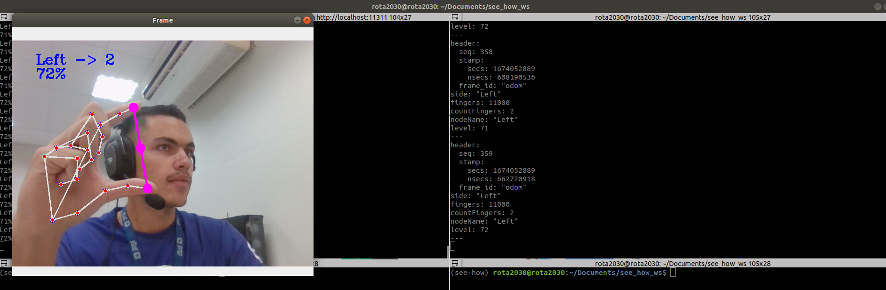

# SEE HOW PACKAGE

<!---Esses são exemplos. Veja https://shields.io para outras pessoas ou para personalizar este conjunto de escudos. Você pode querer incluir dependências, status do projeto e informações de licença aqui--->




> Project developed with the objective of integrating technologies such as computer vision to the ROS, aiming for ease of adaptation. 

### Adjustments and improvements

The project is still under development and the next updates will focus on the following tasks:

- [ ] Graphical View of the Results
- [ ] Docker Image
- [ ] FastApi
- [ ] Database Integration

## 💻 PPrerequisites

Before you begin, check that you have met the following requirements:
<!---Estes são apenas requisitos de exemplo. Adicionar, duplicar ou remover conforme necessário--->
* `Ubuntu 18.04`
* `ROS Melodic`
* `Python 3.10`
* `rospy`
* `ros_numpy`
* `cv2`
* `mediapipe`
* `numpy`
* `math`
* `cv_bridge`

## 🚀 Installing SEE HOW PACKAGE

To install the SEE HOW PACKAGE, follow these steps:

Linux:
```
mkdir -p ws/src
cd ws/src
git clone https://github.com/nata-vito/see_how_pkg.git

cd ..
catkin_make
source devel/setup.bash
```

## ☕ Using SEE HOW PACKAGE

To use SEE HOW PACKAGE, follow these steps:

```
roslaunch see_how_pkg see_how.launch
```

If you can't run it, make sure you have `source devel/setup.bash` inside the ws folder. If not, run the command again in all terminal windows.


## 📫 Contributing to SEE HOW PACKAGE
<!---Se o seu README for longo ou se você tiver algum processo ou etapas específicas que deseja que os contribuidores sigam, considere a criação de um arquivo CONTRIBUTING.md separado--->
To contribute to SEE HOW PACKAGE, follow these steps:

1. Fork this repository.
2. Create a branch: `git checkout -b <nome_branch>`.
3. Make your changes and confirm them: `git commit -m '<mensagem_commit>'`
4. Send to original branch: `git push origin <nome_do_projeto> / <local>`
5. Create the pull request.

Alternatively, see the GitHub documentation on [how to create a pull request].(https://help.github.com/en/github/collaborating-with-issues-and-pull-requests/creating-a-pull-request).

## 🤝 Collaborators

We thank the following people who contributed to this project:

<table>
  <tr>
    <td align="center">
      <a href="#">
        <br>
        <sub>
          <b>Natanael Vitorino</b>
        </sub>
      </a>
    </td>
  </tr>
</table>


## 😄 Be one of the contributors<br>

Want to be part of this project? Click [HERE](CONTRIBUTING.md) and read how to contribute.

## 📝 License

This project is under license. See the file [LICENSE](LICENSE.md) for more details.

[⬆ Back to top](#SEE-HOW-PACKAGE)<br>
